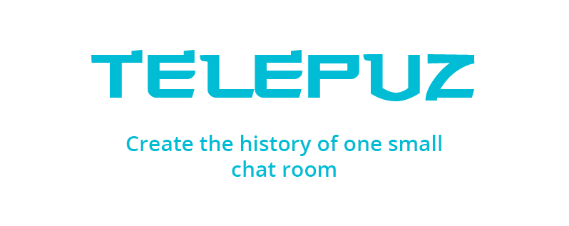

## What is Telepuz?
Telepuz is one public chat room where you can chat with anyone and about anything.

## What was it developed for?
The chat was created for educational and entertainment purposes

## Using code
Copy, modify, refine and take useful practices from the app

## Skills
Telepuz uses many different technologies and practices that are used to create large and high-quality Desktop applications:
* **C#** - programming language.
* **UWP (Universal Windows Program)** - the technology for creating Windows 10 apps, easily publish in Windows Store.
* **MVVM (Model View ViewModel)** - the architecture that Telepuz is built on. Allows you to differentiate between business logic and design;
* **WebSocket** - the TCP data transfer Protocol allows you to transmit data in live mode without making a request to the server;
* **MessagePack** - format for data exchange between the client and the server. It was chosen because of a number of advantages: speed of serialization/deserialization, smaller volume of serialized object than JSON;

## Brief description of the program
### Data exchange between the client and the server
A **mini-protocol** was written on top of WebSocket, which introduces the concept of a method and the data sent to this method. Since WebSocket only transmits bytes, we had to develop our own way to serialize them.

* **Pool of listened methods** - a special dictionary that records callbacks of the methods that we want to listen to when implementing business logic.
For example:

 `client.on("user.create", data)` - start listening for the method, placing it in the pool of all methods. When the server sends data to 'user.create', the mini-Protocol will find it in the dictionary and call a callback, sending a response from the server to it.

 * **MsgPack serializator** -  Was created the class for MsgPack serialization/deserialization that can work with the pool of methods and the form of requests/responses that server approved. 

---

## Who developed it?

Two people worked on the app:

* [KerJen](https://github.com/KerJen) - UWP-developer of Telepuz.
* [undefined](https://github.com/undefined7887) - backend & frontend developer of Telepuz.

## Useful links
[Backend](https://github.com/undefined7887/telepuz-backend) - repository of the server part in Golang

## Contacts
* KerJen - Anton Iankin - @KerJen (Telegram)
* undefined - Iaroslav Evstafiev - @undefined7887 (Telegram)
